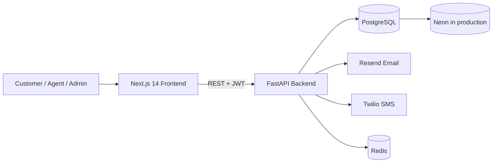
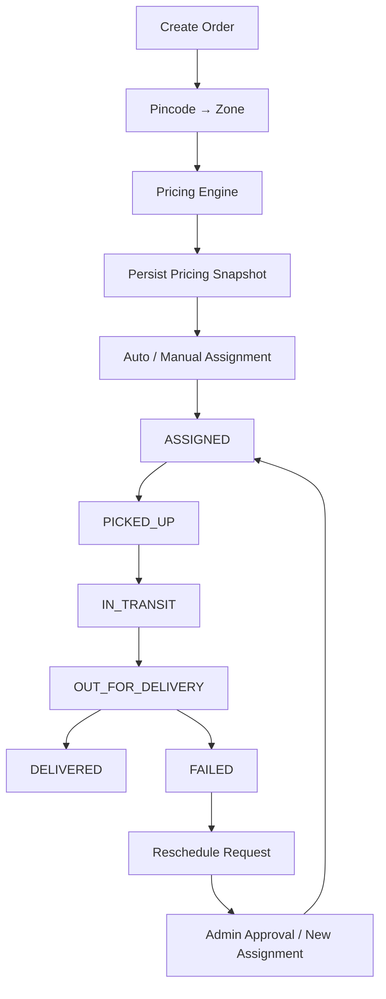

# Last Mile Delivery Tracker

A last-mile delivery management system for order creation, server-side pricing, zone detection, agent assignment, delivery tracking, failed-delivery rescheduling, and notifications.

## Architecture



**Core backend flow:**



## Tech Stack

### Backend
- FastAPI
- SQLAlchemy 2.0 (async)
- Alembic
- PostgreSQL
- JWT authentication + role-based authorization
- Resend email notifications
- Twilio SMS notifications
- Pytest + PostgreSQL Testcontainers

### Frontend
- Next.js 14 App Router
- TypeScript
- Tailwind CSS
- Zustand
- React Hook Form + Zod
- Axios

## Project Structure

```text
backend/                 FastAPI application
├── app/api/             REST endpoints
├── app/core/            configuration and security
├── app/models/          SQLAlchemy models
├── app/schemas/         Pydantic schemas
├── app/services/        business logic
├── app/db/              database/session setup
├── migrations/          Alembic migrations
└── tests/               unit/integration tests

frontend/                Next.js application
docs/                    system, database, pricing and deployment docs
docker-compose.yml       local service orchestration
```

## Quick Start

### Prerequisites
- Docker Desktop + Docker Compose
- Node.js 18+
- Python 3.11+

### Docker

```bash
cp backend/.env.example backend/.env
cp frontend/.env.example frontend/.env.local
# Configure backend/.env

docker-compose up -d
docker-compose exec backend alembic upgrade head
```

- Frontend: `http://localhost:3000`
- Backend: `http://localhost:8000`
- Swagger UI: `http://localhost:8000/docs`

### Local development

```bash
cd backend
python -m venv .venv
source .venv/bin/activate       # Windows: .venv\Scripts\activate
pip install -e ".[dev]"
cp .env.example .env
uvicorn app.main:app --reload
```

In a separate terminal:

```bash
cd frontend
npm install
cp .env.example .env.local
npm run dev
```

## Core Business Logic

### Pricing

```text
Dimensions ──→ Volumetric Weight = L × B × H / 5000
                       │
Actual Weight ─────────┤
                       ▼
                Billable Weight
                       │
             Zone Type + Order Type
                       │
                       ▼
                 Rate Card Rule
                       │
                 Base + per-kg
                       │
                COD surcharge
                       ▼
                   Total Charge
```

All pricing is calculated server-side and the resulting pricing values are persisted with the order.

### Zone detection

Pincodes are mapped to `zone_areas` using an exact match first and prefix fallback where configured. Each zone can have an optional center coordinate used by the MVP assignment algorithm.

### Agent assignment

Eligible agents must be active, available, and below their configured concurrent-delivery capacity. Auto-assignment ranks candidates by:

1. Pickup-zone affinity
2. Haversine distance from the pickup-zone center to the agent's latest location
3. Current delivery load

If no eligible same-zone agent exists, eligible agents from other zones can be considered.

### Order lifecycle

```text
CREATED → ASSIGNED → PICKED_UP → IN_TRANSIT → OUT_FOR_DELIVERY → DELIVERED
                                      │
                                      └────────→ FAILED
                                                    │
                                                    ▼
                                             RESCHEDULE REQUEST
                                                    │
                                                    ▼
                                             NEW ASSIGNMENT
                                                    │
                                                    └→ ASSIGNED
```

`ASSIGNED` means an agent has been selected. It does **not** mean the package has been physically picked up; `PICKED_UP` is an explicit delivery-agent action.

### Failed delivery

A failed attempt records the failure reason, attempt information and tracking data. A customer can request rescheduling and an admin can approve/reject the request and assign an eligible agent for the next attempt.

## Roles

| Role | Main capabilities |
|---|---|
| Customer | Create orders, obtain quotes, track orders, request reschedules |
| Agent | Manage availability/location, view assigned orders, update delivery status |
| Admin | Manage zones/rates, assign agents, override status, manage reschedules |

## Documentation

- [System Design](docs/system-design.md)
- [Database Schema](docs/database-schema.md)
- [Rate Calculation](docs/rate-calculation.md)
- [API Reference](docs/api-docs.md)
- [Deployment Guide](docs/deployment.md)
- [Backend README](backend/README.md)
- [Frontend README](frontend/README.md)
- Swagger UI: `http://localhost:8000/docs` when running locally

## Testing

Backend integration tests use **PostgreSQL through Testcontainers** so the test database engine matches production. Docker Desktop must be running for these tests.

```bash
cd backend
pytest -q
pytest tests/test_integration.py -v
```

Frontend:

```bash
cd frontend
npm test
npm run build
```

## Deployment

- Frontend: Vercel
- Backend: Render or Railway
- Production database: Neon PostgreSQL
- Local services: Docker Compose

See [docs/deployment.md](docs/deployment.md) for configuration and deployment steps.

## License

MIT
