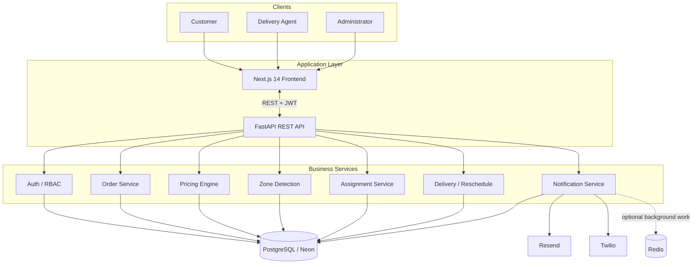
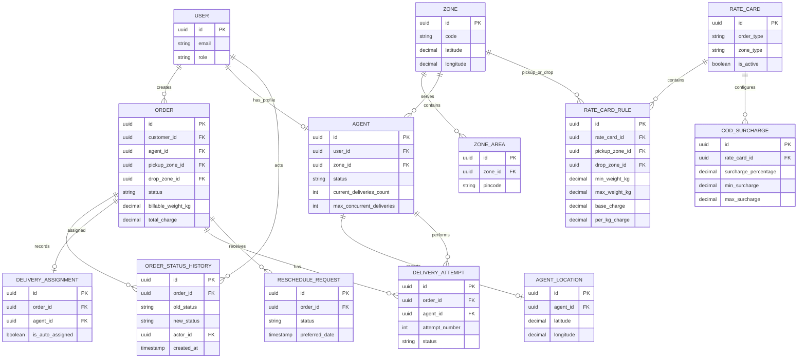
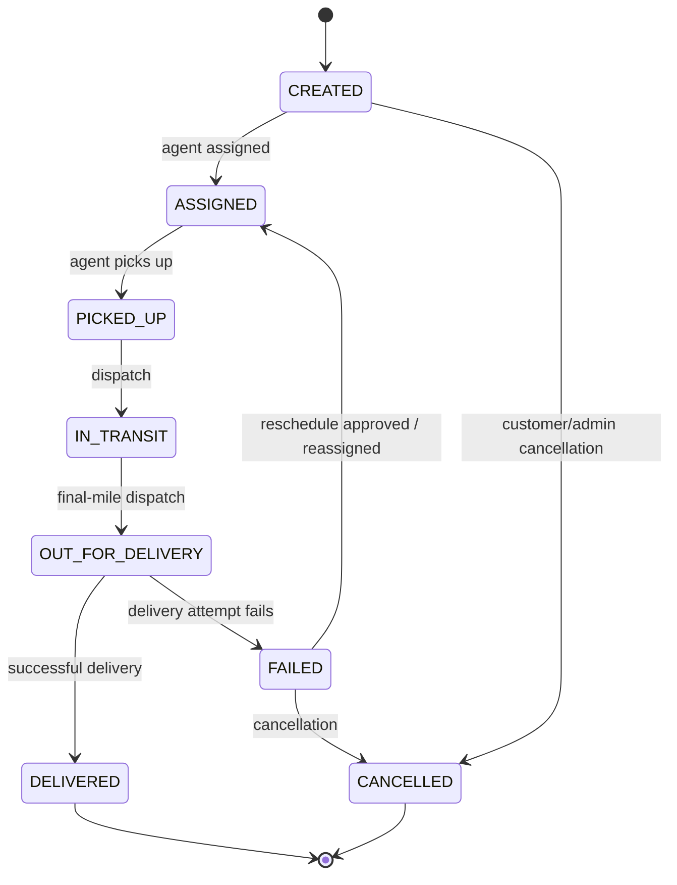
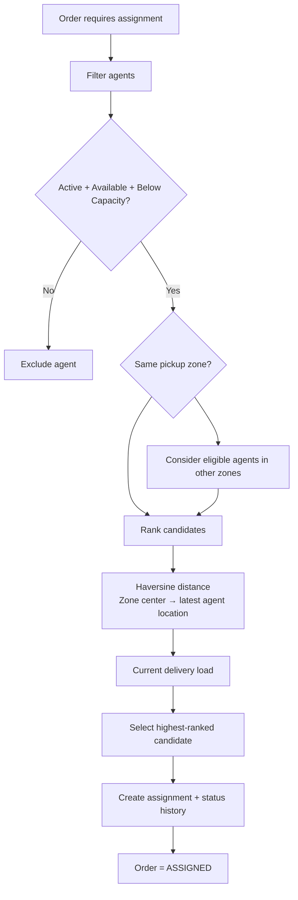
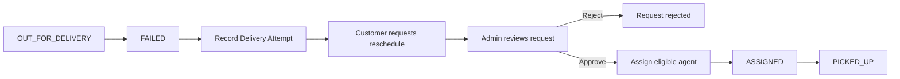
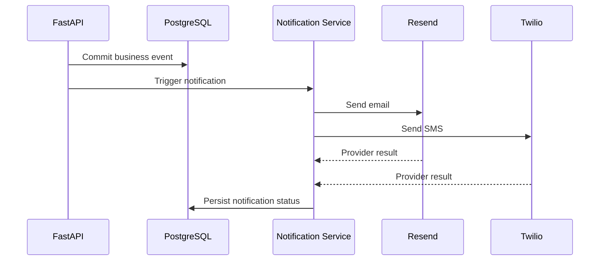
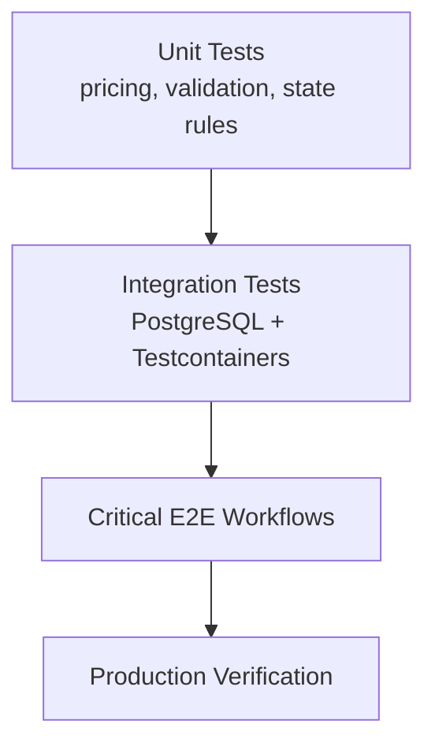

# Last Mile Delivery Tracker — System Design

## 1. Overview

A last-mile delivery management system covering order creation, server-side pricing, pincode-based zone detection, agent assignment, delivery tracking, failed-delivery rescheduling, and email/SMS notifications.

## 2. Architecture



The API is stateless. PostgreSQL is the system of record; Neon PostgreSQL is the production database. Docker Compose is used for local development, and PostgreSQL Testcontainers is used for integration tests.

## 3. Core Data Model



## 4. Pricing Flow

```mermaid
flowchart LR
    D[Dimensions] --> VW[Volumetric Weight<br/>L × B × H / 5000]
    W[Actual Weight] --> BW[Billable Weight<br/>max(actual, volumetric)]
    VW --> BW
    P[Pincodes] --> Z[Pickup + Drop Zones]
    Z --> ZT[Intra / Inter Zone]
    BW --> RR[Rate Card Rule]
    ZT --> RR
    OT[Order Type<br/>B2B / B2C] --> RR
    RR --> BASE[Base + Per-kg Charge]
    PAY[Payment Type] --> COD{COD?}
    OV[Order Value] --> COD
    COD --> SUR[COD Surcharge<br/>percentage + min/max]
    BASE --> TOTAL[Total Charge]
    SUR --> TOTAL
```

### Pricing rules

- Volumetric weight = `L × B × H / 5000`.
- Billable weight = `max(actual weight, volumetric weight)`.
- Zone type is intra-zone when pickup and drop zones match; otherwise inter-zone.
- Rate selection considers order type, zone type, active status, effective dates, pickup/drop zones, and weight slab.
- COD surcharge is applied only to COD orders and is bounded by configured minimum/maximum values.
- Pricing is calculated server-side and the resulting values are stored with the order so later rate-card changes do not rewrite historical order pricing.

## 5. Order Lifecycle



`ASSIGNED` is a first-class order status. It records agent selection and is intentionally distinct from `PICKED_UP`, which is an explicit delivery-agent action.

## 6. Agent Assignment



Ranking order is deterministic:

1. Pickup-zone affinity.
2. Haversine distance from the pickup-zone center to the agent's latest known location.
3. Current delivery load.

Agents at or above `max_concurrent_deliveries`, inactive agents, and unavailable agents are excluded. Zone coordinates are a single optional center point per zone for the MVP.

## 7. Failed Delivery and Rescheduling



Each failed attempt is retained. Rescheduling creates an auditable request and can result in a new assignment/attempt.

## 8. Status History and Auditability

Every status transition records:

- order
- previous status
- new status
- actor
- actor role
- timestamp
- optional reason/context

The history is append-only from the application workflow and is used as the tracking/audit trail.

## 9. Notifications



Notification-provider failure is tracked separately and should not invalidate a successful order/delivery transaction.

## 10. Security

- Password hashing using bcrypt/passlib.
- JWT access/refresh tokens.
- Role-based route authorization for Customer, Agent and Admin.
- Pydantic request validation.
- Configurable CORS origins.
- Secrets supplied through environment variables.

## 11. Testing Strategy



Integration tests use PostgreSQL through Testcontainers so database behavior is close to production. Critical workflows cover order creation, assignment, delivery progression, and failed-delivery/rescheduling.

## 12. Deployment

- **Frontend:** Vercel / Next.js
- **Backend:** Render or Railway / FastAPI + Uvicorn
- **Database:** Neon PostgreSQL
- **Local:** Docker Compose
- **Integration tests:** PostgreSQL Testcontainers

## 13. Scalability and Future Enhancements

The API is stateless and can scale horizontally. SQLAlchemy async connection pooling and indexed PostgreSQL queries support the current workload. Redis/Celery can be introduced for heavier asynchronous processing.

Future enhancements:
- WebSocket-based real-time tracking
- Route optimization
- Analytics dashboards
- React Native mobile client
- Multi-tenant architecture
